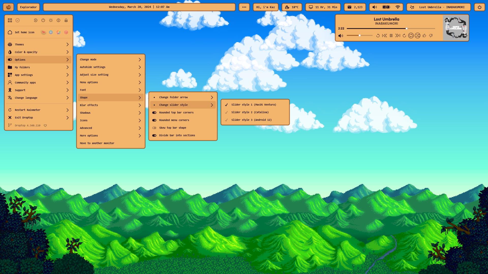

<h1 align="center">
  <a href="#"></a>
  <br>
  Stardew Valley - KazukiGames82
  <br>
</h1>

<h4 align="center">
Stardew Valley theme for Droptop Four.
</h4>

<p align="center">
  <a href="https://droptopfour.com/community-themes">
    
  </a>
  <a href="https://droptopfour.com"></a>
  <a href="https://droptopfour.com/discord">
      
  </a>
  
</p>

<p align="center">
  <a href="#special-code">Special Code</a> •
  <a href="#download">Download</a> •
  <a href="#credits">Credits</a> •
  <a href="#license">License</a>
</p>

<p align="center">
  <a href="#"></a>
</p>

## Special Code

> [!WARNING]
> Add the next conde inside of your Droptop installation to have your floating topbar.<br>
> **This code will be removed every time you update Droptop**.

- Go to `Documents\Rainmeter\Skins\Droptop\@Resources\GlobalVar` and open `Control.inc` file
  - Find `BarXposOffset0` variable and replace it with this:
    ```ini
    BarXposOffset0=10
    ```
- Go to `Documents\Rainmeter\Skins\Droptop\DropdownBar\AppBar` and open `AppBar.ini` file
  - Find `RequiredSpace` option and replace it with this:
    ```ini
    RequiredSpace=(((#TopHeight#+#BarXposOffset0#)*#AlwaysShowSkin#)*(#DisableDPINum#=1?#DPIRescaleValue#:1))
    ```
  - Find `AppBarPosSetAction` option and replace it with this:
    ```ini
    AppBarPosSetAction=[!Move ($left$+#BarXposOffset#) 0 "Droptop\Other\BackgroundProcesses"][!Move ($left$+#BarXposOffset#) ($top$+#BarXposOffset0#) "Droptop\DropdownBar"][!WriteKeyValue Variables TopBarX ($left$+#BarXposOffset#) "#@#GlobalVar\Control.inc"]
    ```


## Download
Download from [releases](https://github.com/KazukiGames82/Stardew_Valley-KazukiGames82/releases) or from the [website](https://www.droptopfour.com/community-themes/?id=36)

## Credits
- Theme inspired by Stardew Valley Game.
- [Logo](https://stardewvalleywiki.com/mediawiki/images/6/68/Main_Logo.png)
- [Chicken as Home Button](https://stardewvalleywiki.com/File:Brown_Chicken.png)

## License
[GNU General Public License v3.0](LICENSE)

Feel free to modify or redistribute these Rainmeter skins as much as you want. Just:
- Link back to me somehow
- Use ths same license
